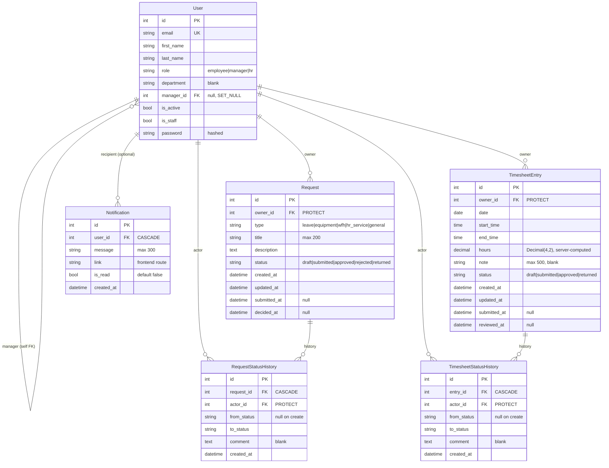
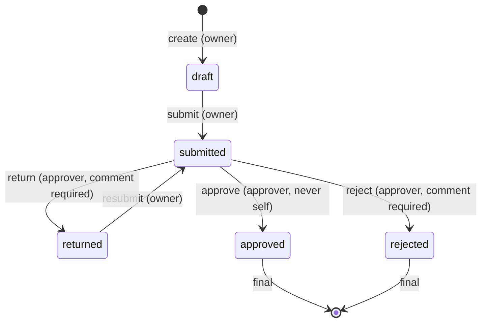
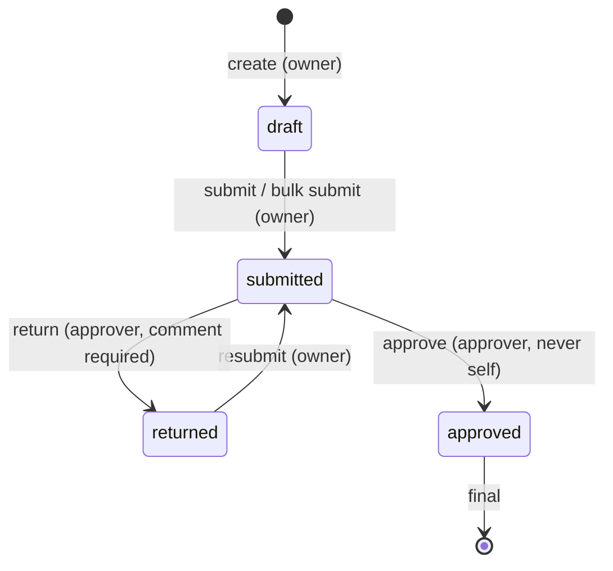

# SAWA — Database Design

Canonical model reference (constitution V: every model change is recorded in the Change log below). Source of truth for fields: `specs/002|003|004|005/plan.md`.

## ERD

## Models

### `accounts.User` — `AbstractBaseUser` + `PermissionsMixin`

| Field | Type | Constraints / validation |
|---|---|---|
| email | EmailField, unique | `USERNAME_FIELD`; login identifier; case-insensitive lookup at auth |
| first_name / last_name | CharField | only fields writable via `PATCH /api/me/` |
| role | CharField TextChoices | `employee` (default) / `manager` / `hr` |
| department | CharField, blank | optional |
| manager | FK→`self`, null, `on_delete=SET_NULL` | `clean()`: ≠ self; manager chain walked to reject cycles |
| is_active / is_staff | bool | inactive → 401 on token obtain/refresh; `is_staff` grants `/admin/` (seeded HR) |

### `employee_requests.Request`

| Field | Type | Constraints |
|---|---|---|
| owner | FK→User, PROTECT | server-set to `request.user` |
| type | CharField TextChoices | `leave`/`equipment`/`wfh`/`hr_service`/`general` |
| title | CharField(200) | required |
| description | TextField | required |
| status | CharField TextChoices | `draft` default; transitions only via actions |
| submitted_at / decided_at | DateTime, null | set on submit / approve·reject |

### `employee_requests.RequestStatusHistory` / `timesheets.TimesheetStatusHistory`

| Field | Type | Constraints |
|---|---|---|
| request / entry | FK, CASCADE, related `history` | |
| actor | FK→User, PROTECT | transition performer |
| from_status | CharField, null | null on the create row |
| to_status / comment / created_at | | comment required for reject/return (enforced at API) |

### `timesheets.TimesheetEntry`

| Field | Type | Constraints |
|---|---|---|
| owner | FK→User, PROTECT | server-set |
| date | DateField | `<= today` |
| start_time / end_time | TimeField | `end_time > start_time` (no overnight) |
| hours | DecimalField(4,2) | computed in `save()`; read-only via API |
| note | CharField(500), blank | optional |
| status | CharField TextChoices | `draft`/`submitted`/`approved`/`returned` |
| submitted_at / reviewed_at | DateTime, null | reviewed_at set on approve + return |

**Overlap rule**: for the same `owner`+`date`, reject a range overlapping any other entry (`NOT (end <= other.start OR start >= other.end)`; excludes self on update).

### `core.Notification` *(optional — feature 005 US2)*

| Field | Type | Constraints |
|---|---|---|
| user | FK→User, CASCADE | recipient only |
| message | CharField(300) | |
| link | CharField(200) | frontend route |
| is_read | bool, default False | |
| created_at | auto_add | ordering: unread first, then newest |

## State machines

### Request

### TimesheetEntry

**Approver rule** (both): owner's direct manager → HR if none; HR may act on any submitted item; nobody acts on their own item.

## Change log

| Date | Change | Spec ref |
|---|---|---|
| 2026-10-02 | Initial design: `User`, `Request`, `RequestStatusHistory`, `TimesheetEntry`, `TimesheetStatusHistory`, `Notification` (optional). `manager` FK = SET_NULL; request types = TextChoices; hours server-computed; status per timesheet entry (no weekly header). | specs 002–005, `docs/plan.md` §0.2 |
